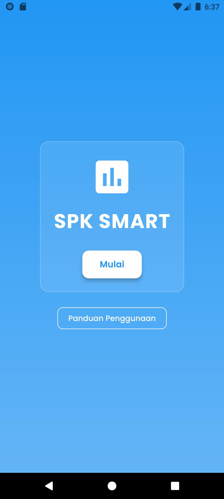
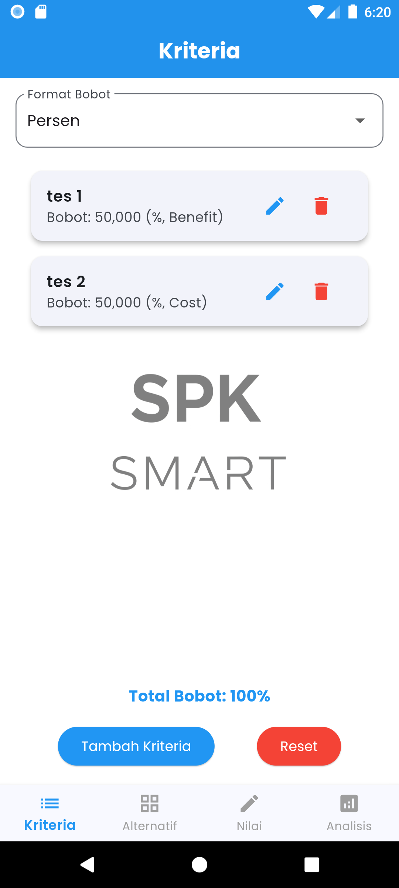
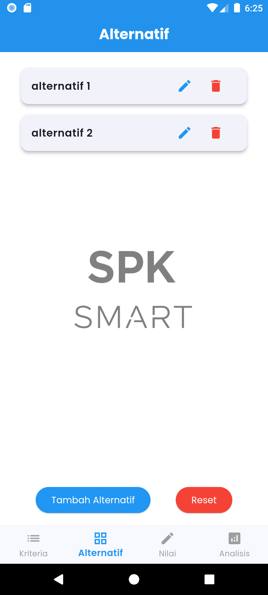
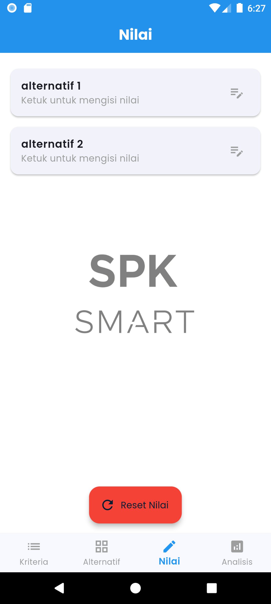
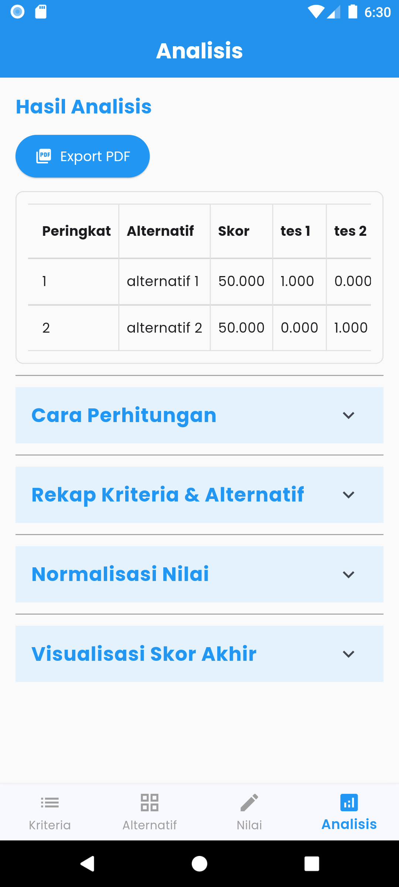

# 📱 SMART SPK Mobile App Sayid

Aplikasi ini merupakan sistem pendukung keputusan (SPK) menggunakan metode **SMART** yang dikembangkan menggunakan Flutter. Aplikasi ini memiliki fitur kriteria, alternatif, penilaian, dan analisis untuk mendapatkan hasil terbaik berdasarkan bobot dan nilai yang diberikan.

---

## 📦 Fitur Utama

- Tambah/Edit/Hapus Kriteria dan Alternatif
- Input Penilaian setiap Alternatif terhadap Kriteria
- Hasil Rekomendasi dengan Perhitungan SMART
- Visualisasi Hasil dalam bentuk grafik

---

---

## 📸 Screenshot Aplikasi

### 🚀 Splash Screen


### 📋 Halaman Kriteria


### 📊 Halaman Alternatif


### 📝 Halaman Input Nilai


### 📈 Halaman Hasil Analisis



---

## 🧰 Persiapan Menjalankan Proyek (Tanpa Build APK)

### 1. Install Software Wajib

1. **Flutter SDK**: [https://flutter.dev/docs/get-started/install/windows](https://flutter.dev/docs/get-started/install/windows)
2. **Android Studio** (beserta SDK & AVD)
3. **VS Code** (sebagai code editor)
4. **Git (opsional)**: [https://git-scm.com](https://git-scm.com)

### 2. Atur Environment Variable

Tambahkan `C:\flutter\bin` ke **System Environment Variable → Path**.

Cek di terminal:
```bash
flutter doctor
```

### 3. Terima Android License
```bash
flutter doctor --android-licenses
```

---

## 🚀 Menjalankan Proyek

### 1. Buka Proyek
- Buka VS Code
- Pilih `File > Open Folder > SMART_SPK_MOBILE`

### 2. Jalankan Perintah
```bash
flutter pub get
flutter run
```

> Jika menggunakan emulator/HP: pastikan emulator berjalan atau HP sudah terkoneksi & USB debugging aktif

---

## 📍 Catatan Tambahan

- Minimum SDK: 21
- Bahasa pemrograman: Dart (Flutter)
- Proyek ini menggunakan font dari Google Fonts (`Poppins`) dan library bawaan Flutter

----------------------------------------------------------------------------------------------------------------------


## 📱 Menjalankan dengan Build APK ---

File instalasi disediakan dalam bentuk APK: **SMART-SPK-Sayid.apk**

## ✅ Langkah Instalasi APK di HP Android

### 1. Pindahkan File APK ke HP
- Pastikan kamu memiliki file `SMART-SPK-Sayid.apk`

### 2. Aktifkan "Sumber Tidak Dikenal"
- Buka **Pengaturan > Keamanan / Privasi**
- Aktifkan opsi **"Izinkan pemasangan aplikasi dari sumber tidak dikenal"**
  (Pada Android 10 ke atas: izinkan untuk aplikasi seperti "File Manager" atau "Chrome")

### 3. Instal APK
- Buka file `SMART-SPK-Sayid.apk` dari File Manager
- Klik **Instal**
- Tunggu hingga proses selesai

### 4. Jalankan Aplikasi
- Setelah instalasi selesai, buka aplikasi **SMART-SPK Sayid**
- Mulai gunakan untuk memasukkan kriteria, alternatif, nilai, dan lihat hasil analisis!

---

## 📝 Catatan Tambahan

- Pastikan memori penyimpanan cukup
- Aplikasi ini tidak memerlukan koneksi internet
- Tidak memerlukan akses root atau izin sensitif

---

## ❓ Masalah Umum

| Masalah                                    | Solusi                                                                 |
|-------------------------------------------|------------------------------------------------------------------------|
| Tidak bisa instal / tombol "Instal" abu-abu | Pastikan fitur "Sumber Tidak Dikenal" sudah diaktifkan                |
| APK tidak muncul di file manager           | Cek folder "Download" atau coba gunakan file manager lain             |
| Aplikasi tidak terbuka                     | Coba restart HP atau hapus versi sebelumnya sebelum instal ulang      |

---

## 👨‍💻 Developer

**Nama:** Sayid  
**Proyek:** Aplikasi Sistem Pendukung Keputusan  
**Metode:** SMART (Simple Multi Attribute Rating Technique)  
**Teknologi:** Flutter (Mobile App)

---


----------------------------------------------------------------------------------------------------------------------
